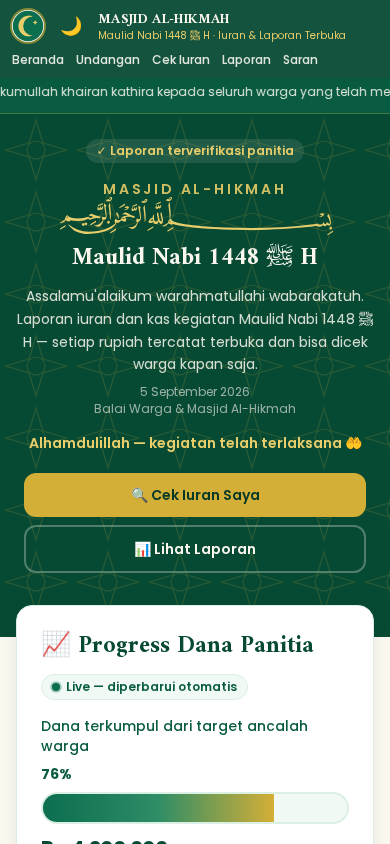
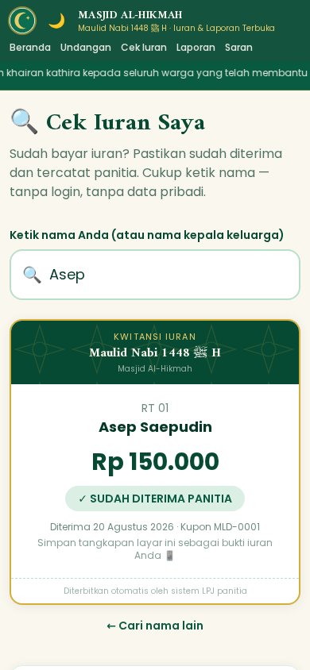
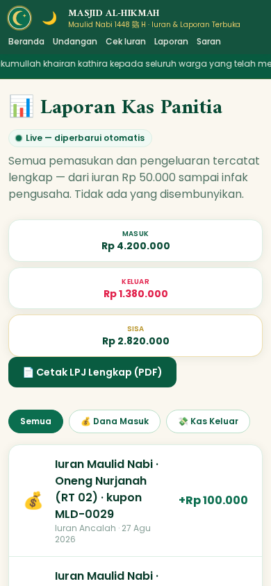
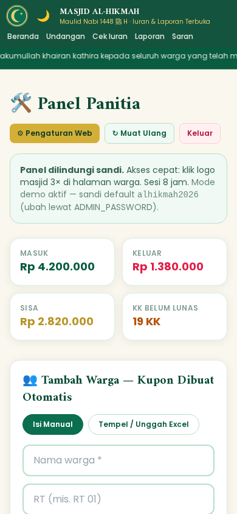

<div align="center">

# 🕌 LPJ Digital untuk Masjid & DKM

**Platform laporan pertanggungjawaban yang transparan, realtime, dan gratis —**
dari iuran warga sampai LPJ siap cetak.

Next.js · Supabase · Vercel · Fonnte (WhatsApp)

**[Coba 2 Menit](#-coba-dulu-tanpa-instal-apa-apa) · [Pasang Sendiri](#-pasang-sendiri-gratis-3045-menit) · [Fitur Lengkap](#-fitur)**

</div>

---

## 🌙 Cerita di Baliknya

Proyek ini lahir dari kebutuhan nyata: **warga minta transparansi, panitia kewalahan dengan Excel.**

> "Uang iuran saya sudah masuk belum?" — pertanyaan yang tiap hari harus
> dijawab bendahara dengan buka Excel satu per satu.

Untuk Maulid Nabi ﷺ 1448 H, DKM Masjid Al-Hikmah membangun platform ini
agar **seluruh warga bisa melihat kas secara realtime** — dan saat LPJ
dibacakan di pengajian, semua angka sudah terbuka, berjalan sendiri,
lengkap dengan bukti nota.

Sekarang kodenya dibagikan **gratis** supaya masjid, mushala, dan DKM
lain tidak perlu mulai dari nol. **Semoga menjadi amal jariyah.** 🤲

## ✨ Fitur

**Untuk warga (tanpa login):**
- 🏠 **Beranda** — progres kas realtime, jadwal sholat, social proof tamu & saran warga
- 🔎 **Cek Iuran** — cari nama / scan QR kupon → kwitansi digital (sudah bayar / belum)
- 📊 **Laporan** — arus kas lengkap + foto bukti nota tiap pengeluaran
- 💌 **Undangan** — RSVP + hitung mundur hari-H
- 📜 **Proposal** — halaman sponsor interaktif dengan CTA donasi
- 💬 **Kotak Saran** — masukan warga, tampil setelah dimoderasi

**Untuk panitia (sandi):**
- 🔐 Panel admin — akses lewat klik logo 3× atau `/admin/login`
- 👥 CRUD warga — tempel dari Excel, anti-dobel, kelas iuran otomatis (K1/K2/K3/Sponsor)
- 🎟️ Kupon ber-QR — cetak A4 per kelas, kirim via WhatsApp per warga
- 💰 Catat kas — pemasukan/pengeluaran + upload foto nota (maks 4 MB)
- 📦 **Donasi barang terpisah dari kas uang** (non-kas, tampil terpisah)
- 📱 Notifikasi WhatsApp otomatis ke grup panitia (via Fonnte, gratis)
- ⏰ Rekap harian otomatis jam 20:00 WIB (Vercel Cron) — berhenti sendiri setelah acara
- 🖨️ LPJ siap cetak/PDF (desktop: tabel rapi, HP: kartu)
- 🌙 Mode gelap + responsif penuh di HP

## 📸 Tangkapan Layar

| Beranda & Progres Realtime | Kwitansi Digital (Cek Iuran) |
|---|---|
|  |  |

| Laporan Kas + Bukti Nota | Panel Panitia |
|---|---|
|  |  |

*(Semua tangkapan layar memakai data contoh / mode demo.)*

## 🚀 Coba Dulu (Tanpa Instal Apa-apa)

```bash
git clone https://github.com/mouziqiufashionkids-dev/LPJ-Digital.git
cd LPJ-Digital
npm install
npm run dev
```

Buka `http://localhost:3000` → jalan dengan **data contoh (mode demo)**,
tanpa database, tanpa akun, tanpa konfigurasi. Login panitia demo:
klik logo 3× → sandi `alhikmah2026`.

> Ingin lihat pemakaian nyata? Lihat
> [dkm-alhikmah.vercel.app](https://dkm-alhikmah.vercel.app) —
> LPJ Maulid Nabi ﷺ 1448 H DKM Masjid Al-Hikmah (contoh produksi).

## 🛠️ Pasang Sendiri (Gratis, ±30–45 menit)

Semua layanan pakai **free tier** — total biaya **Rp 0**:

| Layanan | Fungsi | Biaya |
|---|---|---|
| [Vercel](https://vercel.com) | hosting web | gratis |
| [Supabase](https://supabase.com) | database + storage foto | gratis |
| [Fonnte](https://fonnte.com) | kirim WhatsApp ke grup | gratis |

**Ringkasan 4 langkah** (panduan lengkap: [docs/DEPLOY.md](docs/DEPLOY.md)
atau versi tanpa terminal: [docs/PANDUAN-SETUP-WEBSITE.md](docs/PANDUAN-SETUP-WEBSITE.md)):

1. **Fork/clone** repo ini ke akun GitHub-mu
2. **Supabase** → new project → jalankan `supabase/schema.sql` di SQL Editor →
   salin `Project URL` + `service_role` key
3. **Vercel** → import repo → set env vars → deploy:

   | Env | Isi |
   |---|---|
   | `NEXT_PUBLIC_SUPABASE_URL` | Project URL Supabase |
   | `SUPABASE_SERVICE_ROLE_KEY` | service_role key (jangan kasih awalan `NEXT_PUBLIC_`!) |
   | `ADMIN_PASSWORD` | sandi panel panitimu **(WAJIB ganti!)** |
   | `NEXT_PUBLIC_SITE_URL` *(opsional)* | domain custom, mis. `https://masjidku.my.id` |
   | `CRON_SECRET` *(opsional)* | kunci tambahan untuk melindungi endpoint cron |

4. Buka web-mu → klik logo 3× → login → ganti pengaturan (nama masjid,
   tanggal acara, rekening) → impor daftar warga → selesai! 🎉

**Pengaturan harian tidak perlu terminal** — nama masjid, tanggal acara,
marquee, anggaran (RAB), hingga token Fonnte semuanya diedit dari menu
**Pengaturan Web** di panel panitia.

## ❓ FAQ

**Kok gratis semua?** Free tier Vercel + Supabase cukup untuk kegiatan
kampung (±500 foto bukti). Fonnte gratis untuk pengiriman WA wajar.

**Bagaimana notifikasi WhatsApp bekerja?** Daftar Fonnte dengan nomor WA
bendahara → scan QR → masukkan bot ke grup panitia → isi token & Group ID
di menu Pengaturan Web. Setiap transaksi & kupon lunas otomatis terkirim.

**Rekap harian berhenti kapan?** Otomatis berhenti setelah tanggal acara
(diambil dari Pengaturan Web). Bisa juga kirim manual pesan penutup
(terima kasih + laporan akhir) dari panel panitia.

**Bisa untuk acara selain Maulid?** Bisa — nama kegiatan, tanggal, dan
seluruh teks bisa diganti dari pengaturan (qurban, haul, santunan, dll).

**Data warga aman?** Halaman publik hanya menampilkan nama + status iuran.
Panel panitia dilindungi sandi, dan semua API panitia lewat middleware
server-side. *Tetap jangan commit file `.env` ke repo.*

## 🤝 Berbagi & Kontribusi

- Mau sebar ke masjid lain? Ada template pesannya di [docs/BAGIKAN.md](docs/BAGIKAN.md)
- Mau bantu kembangkan? Baca [CONTRIBUTING.md](CONTRIBUTING.md)
- Menemukan masalah? Buka issue di GitHub

## 📁 Struktur Singkat

```
src/app/            halaman publik + panel panitia + API routes
src/lib/            store (Supabase/demo), notifikasi WA, konten editable
src/components/     komponen UI (ticker, marquee, kupon, dll)
supabase/schema.sql skema database (jalankan sekali di SQL Editor)
docs/               panduan deploy, setup tanpa terminal, berbagi
```

## 📜 Lisensi

[MIT](LICENSE) — pakai gratis, ubah gratis, sebar gratis.
Kami hanya mohon doanya: **semoga bermanfaat untuk umat.** 🌙

---

<div align="center">

**Barakallahu fiikum** — dibuat dengan ♥ oleh Panitia Maulid Nabi ﷺ 1448 H,
DKM Masjid Al-Hikmah

</div>
